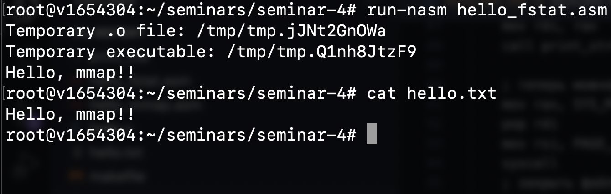

## Задание 1


### `hello.txt`

```
Hello, mmap!!
```

### `hello_mmap.asm`

```asm
; hello_mmap.asm

%define O_RDONLY 0 
%define PROT_READ 0x1
%define MAP_PRIVATE 0x2
%define SYS_WRITE 1
%define SYS_OPEN 2
%define SYS_MMAP 9
%define SYS_MUNMAP 0xb
%define SYS_CLOSE 0x3
%define SYS_EXIT 60
%define FD_STDOUT 1
%define PAGE_SIZE 1024 * 4

section .data
    ; This is the file name. You are free to change it.
    fname: db 'hello.txt', 0

section .text
global _start

; use exit system call to shut down correctly
exit:
    mov  rax, SYS_EXIT
    xor  rdi, rdi
    syscall

; These functions are used to print a null terminated string
; rdi holds a string pointer
print_string:
    push rdi
    call string_length
    pop  rsi
    mov  rdx, rax 
    mov  rax, SYS_WRITE
    mov  rdi, FD_STDOUT
    syscall
    ret

string_length:
    xor  rax, rax
.loop:
    cmp  byte [rdi+rax], 0
    je   .end 
    inc  rax
    jmp .loop 
.end:
    ret

; This function is used to print a substring with given length
; rdi holds a string pointer
; rsi holds a substring length
print_substring:
    mov  rdx, rsi 
    mov  rsi, rdi
    mov  rax, SYS_WRITE
    mov  rdi, FD_STDOUT
    syscall
    ret

_start:
    ; Вызовите open и откройте fname в режиме read only.
    mov  rax, SYS_OPEN
    mov  rdi, fname
    mov  rsi, O_RDONLY    ; Open file read only
    mov  rdx, 0 	      ; We are not creating a file
                          ; so this argument has no meaning
    syscall
    ; rax holds the opened file descriptor now

    ; Вызовите mmap c правильными аргументами
    ; Дайте операционной системе самой выбрать, куда отобразить файл
    ; Размер области возьмите в размер страницы 
    ; Область не должна быть общей для нескольких процессов 
    ; и должна выделяться только для чтения.
    push rax
    mov r8, rax          ; fd
    mov rax, SYS_MMAP
    mov rdi, 0           ; addr
    mov rsi, PAGE_SIZE   ; len
    mov rdx, PROT_READ   ; prot
    mov r10, MAP_PRIVATE ; flags
    mov r9, 0            ; offset
    syscall

    ; с помощью print_string теперь можно вывести его содержимое
    push rax
    mov rdi, rax
    call print_string

    ; теперь можно освободить память с помощью munmap
    mov rax, SYS_MUNMAP
    pop rdi
    mov rsi, PAGE_SIZE
    syscall
    ; закрыть файл используя close

    mov rax, SYS_CLOSE
    pop rdi
    syscall
    ; и выйти
    call exit
```

## Задание 2



### `hello_fstat.asm`

```nasm
; hello_fstat.asm

%define O_RDONLY 0 
%define PROT_READ 0x1
%define MAP_PRIVATE 0x2
%define SYS_WRITE 1
%define SYS_OPEN 2
%define SYS_MMAP 9
%define SYS_MUNMAP 0xb
%define SYS_CLOSE 0x3
%define SYS_EXIT 60
%define SYS_FSTAT 0x5
%define FD_STDOUT 1
%define FSTAT_STRUCT_SIZE 144
%define FSTAT_SIZE_OFFSET 48
%define PAGE_SIZE 1024 * 4 

section .data
    ; This is the file name. You are free to change it.
    fname: db 'hello.txt', 0

section .text
global _start

; use exit system call to shut down correctly
exit:
    mov  rax, SYS_EXIT
    xor  rdi, rdi
    syscall

; These functions are used to print a null terminated string
; rdi holds a string pointer
print_string:
    push rdi
    call string_length
    pop  rsi
    mov  rdx, rax 
    mov  rax, SYS_WRITE
    mov  rdi, FD_STDOUT
    syscall
    ret

string_length:
    xor  rax, rax
.loop:
    cmp  byte [rdi+rax], 0
    je   .end
    inc  rax
    jmp .loop 
.end:
    ret

; This function is used to print a substring with given length
; rdi holds a string pointer
; rsi holds a substring length
print_substring:
    mov  rdx, rsi 
    mov  rsi, rdi
    mov  rax, SYS_WRITE
    mov  rdi, FD_STDOUT
    syscall
    ret

; rsi - fd
get_file_size:
    sub rsp, FSTAT_STRUCT_SIZE
    mov rax, SYS_FSTAT
    mov rsi, rsp
    syscall
    mov rax, [rsp + FSTAT_SIZE_OFFSET]
    add rsp, FSTAT_STRUCT_SIZE
    ret

_start:
    sub rsp, 8 * 2
    ; Вызовите open и откройте fname в режиме read only.
    mov  rax, SYS_OPEN
    mov  rdi, fname
    mov  rsi, O_RDONLY    ; Open file read only
    mov  rdx, 0 	      ; We are not creating a file
                          ; so this argument has no meaning
    syscall
    ; rax holds the opened file descriptor now

    ; Вызовите mmap c правильными аргументами
    ; Дайте операционной системе самой выбрать, куда отобразить файл
    ; Размер области возьмите в размер страницы 
    ; Область не должна быть общей для нескольких процессов 
    ; и должна выделяться только для чтения.
    mov [rsp + 0], rax ; rsp + 0 <- fd
    mov r8, rax          ; fd
    mov rax, SYS_MMAP
    mov rdi, 0           ; addr
    mov rsi, PAGE_SIZE   ; len
    mov rdx, PROT_READ   ; prot
    mov r10, MAP_PRIVATE ; flags
    mov r9, 0            ; offset
    syscall
    mov [rsp + 8], rax ; rax <- &str

    ; с помощью print_string теперь можно вывести его содержимое
    mov rdi, [rsp + 0] ; rdi <- fd
    call get_file_size
    mov rsi, rax
    mov rdi, [rsp + 8]
    call print_string

    ; теперь можно освободить память с помощью munmap
    mov rax, SYS_MUNMAP
    mov rdi, [rsp + 8]
    mov rsi, PAGE_SIZE 
    syscall
    ; закрыть файл используя close

    mov rax, SYS_CLOSE
    mov rdi, [rsp + 0]
    syscall
    ; и выйти
    add rsp, 8 * 2
    call exit
```

## Задание 3


### `string.asm`

```nasm
; string.asm
global world
global print_string

section .rodata
message: db ", world!", 10, 0

section .text

string_length:
    mov rax, 0
    .loop:
      xor  rax, rax
    .count:
      cmp  byte [rdi+rax], 0
      je   .end
      inc  rax
      jmp  .count
    .end:
      ret

world:
    mov  rdi, message

print_string:
    push rax
    push rdi
    call string_length
    mov  rsi, [rsp]
    mov  rdx, rax
    mov  rax, 1
    mov  rdi, 1
    push rcx
    syscall
    pop  rcx
    pop  rdi
    pop  rax
    ret
```

### `hello.c`

```nasm
/* hello.c */

extern void print_string(char* s);
extern void world();

int main() {
    print_string("hello");
    world();
}
```

### `makefile`

```make
CFLAGS     = -g -O2 -Wall -Werror -std=c17 -Wdiscarded-qualifiers -Wincompatible-pointer-types -Wint-conversion
CC         = gcc
LD         = gcc
ASM        = nasm
ASMFLAGS   =-felf64 -g

# Если есть код на C, то компоновку тоже нужно производить
# с помощью gcc, а не ld
hello: hello.o string.o
	$(LD) -o $@ $^

# target : dependencies
#     do this
hello.o: hello.c 
	$(CC) -c $(CFLAGS) -o $@ $<

string.o: string.asm
	$(ASM) $(ASMFLAGS) -o $@ $<

clean: 
	$(RM) hello hello.o string.o

.PHONY: clean
```

## Задание 4


### `print_file/hello.txt`

```
Halo!
```

### `print_file/makefile`

```make
CFLAGS     = -g -O2 -Wall -Werror -std=c17 -Wdiscarded-qualifiers -Wincompatible-pointer-types -Wint-conversion
CC         = gcc
LD         = gcc
ASM        = nasm
ASMFLAGS   =-felf64 -g

# Если есть код на C, то компоновку тоже нужно производить
# с помощью gcc, а не ld
main: file.o print_file.o
	$(LD) -o $@ $^

# target : dependencies
#     do this
file.o: file.c 
	$(CC) -c $(CFLAGS) -o $@ $<

print_file.o: print_file.asm
	$(ASM) $(ASMFLAGS) -o $@ $<

clean: 
	$(RM) main file.o print_file.o

.PHONY: clean
```

### `print_file/print_file.asm`

```nasm
; print_file.asm

%define O_RDONLY 0 
%define PROT_READ 0x1
%define MAP_PRIVATE 0x2
%define SYS_WRITE 1
%define SYS_OPEN 2
%define SYS_MMAP 9
%define SYS_MUNMAP 0xb
%define SYS_CLOSE 0x3
%define SYS_EXIT 60
%define SYS_FSTAT 0x5
%define FD_STDOUT 1
%define FSTAT_STRUCT_SIZE 144
%define FSTAT_SIZE_OFFSET 48
%define PAGE_SIZE 1024 * 4 

global print_file
global print_string
section .text

; use exit system call to shut down correctly
exit:
    mov  rax, SYS_EXIT
    xor  rdi, rdi
    syscall

; These functions are used to print a null terminated string
; rdi holds a string pointer
print_string:
    push rdi
    call string_length
    pop  rsi
    mov  rdx, rax 
    mov  rax, SYS_WRITE
    mov  rdi, FD_STDOUT
    syscall
    ret

string_length:
    xor  rax, rax
.loop:
    cmp  byte [rdi+rax], 0
    je   .end
    inc  rax
    jmp .loop 
.end:
    ret

; This function is used to print a substring with given length
; rdi holds a string pointer
; rsi holds a substring length
print_substring:
    mov  rdx, rsi 
    mov  rsi, rdi
    mov  rax, SYS_WRITE
    mov  rdi, FD_STDOUT
    syscall
    ret

; rsi - fd
get_file_size:
    sub rsp, FSTAT_STRUCT_SIZE
    mov rax, SYS_FSTAT
    mov rsi, rsp
    syscall
    mov rax, [rsp + FSTAT_SIZE_OFFSET]
    add rsp, FSTAT_STRUCT_SIZE
    ret

; rdi - filename
print_file:
    sub rsp, 8 * 2
    ; Вызовите open и откройте fname в режиме read only.
    mov  rax, SYS_OPEN
    mov  rsi, O_RDONLY    ; Open file read only
    mov  rdx, 0 	      ; We are not creating a file
                          ; so this argument has no meaning
    syscall
    ; rax holds the opened file descriptor now

    ; Вызовите mmap c правильными аргументами
    ; Дайте операционной системе самой выбрать, куда отобразить файл
    ; Размер области возьмите в размер страницы 
    ; Область не должна быть общей для нескольких процессов 
    ; и должна выделяться только для чтения.
    mov [rsp + 0], rax ; rsp + 0 <- fd
    mov r8, rax          ; fd
    mov rax, SYS_MMAP
    mov rdi, 0           ; addr
    mov rsi, PAGE_SIZE   ; len
    mov rdx, PROT_READ   ; prot
    mov r10, MAP_PRIVATE ; flags
    mov r9, 0            ; offset
    syscall
    mov [rsp + 8], rax ; rax <- &str


    ; с помощью print_string теперь можно вывести его содержимое
    mov rdi, [rsp + 0] ; rdi <- fd
    call get_file_size
    mov rsi, rax
    mov rdi, [rsp + 8]
    call print_substring

    ; теперь можно освободить память с помощью munmap
    mov rax, SYS_MUNMAP
    mov rdi, [rsp + 8]
    mov rsi, PAGE_SIZE 
    syscall
    ; закрыть файл используя close

    mov rax, SYS_CLOSE
    mov rdi, [rsp + 0]
    syscall
    ; и выйти
    add rsp, 8 * 2
    ret
```

### `print_file/file.c`

```c
/* file.c */

#include <stdio.h>

extern void print_file(char* file_name);
extern void print_string(char* s);

int main() {
    char buffer[1000] = {0};
    print_string("Enter filepath:");
    int _ = scanf("%s", buffer);
    (void) _;
    print_file(buffer);
    return 0;
}
```
